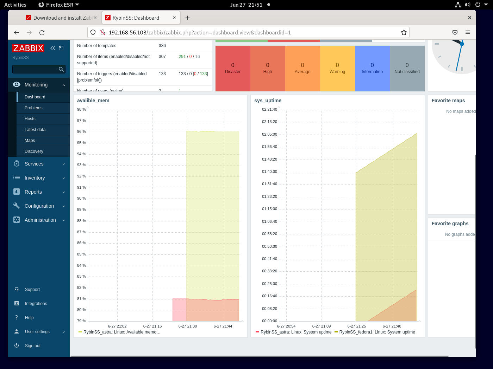

# mon_hw_8.04_zabbix2
zabbix2

### Задание 1

`Создайте свой шаблон, в котором будут элементы данных, мониторящие загрузку CPU и RAM хоста`

1. `Создайте Item который будет собирать информацию об загрузке CPU в процентах`
2. `Создайте Item который будет собирать информацию об загрузке RAM в процентах`

  
  


```
```


### Задание 2

`Добавьте в Zabbix два хоста`

1. `Установите Zabbix Agent на 2 виртмашины`
2. `Добавьте Zabbix Server в список разрешенных серверов ваших Zabbix Agentов`
3. `Добавьте Zabbix Agentов в раздел Configuration > Hosts вашего Zabbix Servera`
4. `Прикрепите за каждым хостом шаблон Linux by Zabbix Agent`
5. `Проверьте что в разделе Latest Data начали появляться данные с добавленных агентов`

++++++++++

### Задание 3

`Привяжите созданный шаблон к двум хостам. Также привяжите к обоим хостам шаблон Linux by Zabbix Agent.`

1. `Зайдите в настройки каждого хоста и в разделе Templates прикрепите к этому хосту ваш шаблон`
2. `Так же к каждому хосту привяжите шаблон Linux by Zabbix Agent`
3. `Проверьте что в раздел Latest Data начали поступать необходимые данные из вашего шаблона`

  

### Задание 4

`Создайте свой кастомный дашборд`

1. `В разделе Dashboards создайте новый дашборд`
2. `Разместите на нём несколько графиков на ваше усмотрение.`

  

### Задание 5

`Создайте карту и расположите на ней два своих хоста.`

1. `Настройте между хостами линк`
2. `Привяжите к линку триггер, связанный с agent.ping одного из хостов, и установите индикатором сработавшего триггера красную пунктирную линию.`
3. `Выключите хост, чей триггер добавлен в линк. Дождитесь срабатывания триггера.`

  
  
